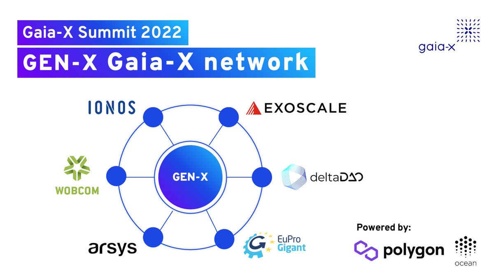

The Pan-European GEN-X network is owned by no one and is open to everyone. It is entirely run and governed by Gaia-X community members dedicated to the Gaia-X Trust Framework. Early network validators include Arsys (Spain), deltaDAO (Germany), EuProGigant (Austria/Germany), Exoscale (Switzerland/Austria/Germany), Ionos (Germany), Wobcom (Germany), with more to follow.

The newest decentralized autonomous ecosystem of Gaia-X will leverage Polygon Supernets to scale an open, secure, and compliant federated digital ecosystem and identify a framework for businesses and institutions adopting and building towards Gaia-X.

This blog focuses on technical and governance topics revolving around GEN-X. Currently, new content can only be added by the GEN-X validators and active contributors.
