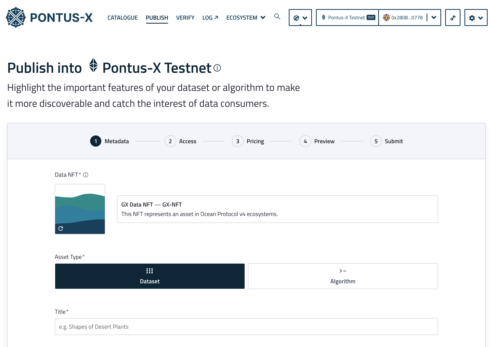
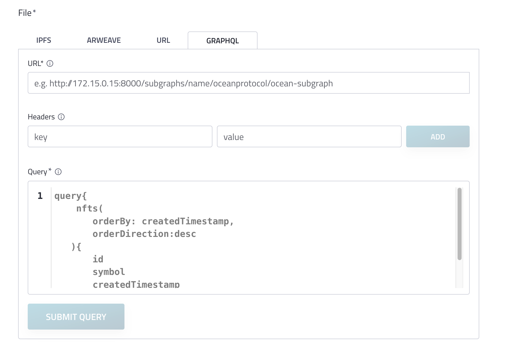

# Data Service Offerings in Pontus-X

In the Pontus-X world, a data service is identified by the keyword `dataset`. This keyword can be found in the metadata object describing the asset, as well as in Pontus-X portals.

Pontus-X components are based on the open source Ocean Protocol project. This documentation covers only a subset of features within the Pontus-X ecosystem. For more information on the Ocean Protocol tech stack, please refer to the [Official Ocean Protocol Documentation](https://docs.oceanprotocol.com/developers/architecture).

## FAQ

### Do I have to upload my data to Pontus-X?

**No!** Your data can remain in its current location while still being connected to Puntus-X components, ensuring that it stays within your controlled environment.

### How is the data protected?

The consumer will never receive direct access to the data source. Raw data or compute results will always be relayed using the provider(access controller) component as proxy. To ensure privacy and sovereignty of the data it's required to use a provider which is either self-hosted or provided by a trusted 3rd party.


## How to publish a Data Service?

There are multiple ways of publishing data services in the Pontus-X ecosystem.

### Pontus-X Portals

You can use a portals connected to the ecosystem to publish your data service. You can either use the [Pontus-X portal](https://www.pontus-x.eu/) which is the reference implementation or any domain specific portal (e.g. [EuProGigant Protal](https://portal.euprogigant.io/)). Select asset type `dataset` in the publish process.



### JavaScript(TypeScript) & Python libraries

You can use existing libraries to connect your applications to the Pontus-X ecosystem or to automate tasks.

#### Nautilus (recommended)

[Nautilus](https://github.com/deltaDAO/nautilus) is a wrapper library for Ocean.js written in TypeScript, developed by deltaDAO. It includes a lot of helper functions and builder classes which help you to publish, consume and manage services offerings.

Nautilus is open source, licensed under Apache-2.0 and available as [NPM package](https://www.npmjs.com/package/@deltadao/nautilus).

#### Ocean.js

[Ocean.js](https://github.com/oceanprotocol/ocean.js) is the official Javascript library developed by the Ocean Protocol Foundation. It offers more fine grained interactions with the smart contracts to publish, consume and manage services offerings, but is also more difficult to use than nautilus.

#### Ocean.py

[Ocean.py](https://github.com/oceanprotocol/ocean.py) is the official Python library developed by the Ocean Protocol Foundation. It offers possibilities to interact with the smart contracts to publish, consume and manage services offerings.

## Access(download) vs Compute type offerings

We distinguish between two types of data service offerings:

1. `access` (download)
   Access datasets allow the consumer to download the raw data. The provider component acts as a proxy and creates a download link for the consumer. The original access credentials to the data are not exposed.

2. `compute`
   This option prevents sharing of raw data. The most common usecase is to bring an algorithm to the infrastructure of the data owner (Compute-to-Data). The data service publisher can configure trusted algorithms and/or publishers using the allow/deny list feature. The consumer only receives the results generated by the algorithm, never the raw input data.

   This enables new use cases where computing on sensitive data has not been possible due to privacy or intellectual property concerns.

## Supported data sources

### Static File URLs

**Parameters:**

- `type` - Specifies the data source type, required 
- `url` - File URL, required
- `method` - The HTTP method, required
- `headers` - Additional HTTP headers, optional

```json
{
    "type": "url",
    "url": "https://your-files.com/file1.json",
    "method": "GET",
    "headers": {
      "Authorization": "Bearer YOUR_ACCESS_TOKEN",
      "API-KEY": "YOUR_API_KEY",
      "Custom-Header": "custom-value-if-needed"
    }
}
```

### (REST) APIs

```json
{
  "type": "url",
  "url": "https://mobility-api.com/charging_stations?available=true",
  "method": "GET",
  "headers": {
    "Authorization": "Bearer YOUR_ACCESS_TOKEN",
    "API-KEY": "YOUR_API_KEY"
  }
}
```

#### Query parameter

Query parameter can be preset as part of the URL or can be configured as `consumerParameters` and set by the consumer during the consumption process to have more flexibility. 

**Example**: You want to enable the consumer to set the following query parameters dynamically during consumption.

- `hometown`

- `age`

- `developer`

- `languagePreference`

  

1. You define the api endpoint without parameters as GET request.

```json
{
  "type": "url",
  "url": "https://my-cool.app/api",
  "method": "GET"
}
```

2. You configure `consumerParameters`. In the portals you look for the `User defined parameters` option in the `Access` step of the publishing process.

   

   

   

   

   The access controller(provider) will use these parameters and construct a query-string, such as: `https://my-cool.app/api?hometown=Hamburg&age=30&developer=false&languagePreference=nodejs` As always, users won’t see these urls, it will only be decrypted and enhanced by the provider and results will be relayed to the consumer.

   #### POST Requests

   If the request was described as a POST-Request, this will be transformed into a POST JSON body by the provider, e.g.:

   ```
   {
       "hometown": "Hamburg",
       "age": 33,
       "developer": false,
       "languagePreference": "nodejs"
   }
   ```

### GraphQL

GraphQL is a powerful query language for APIs, designed to streamline data retrieval by enabling seamless integration with various data sources. Enabling seamless integration and querying of your existing data from various sources (e.g., MongoDB, MySQL, PostgreSQL). 



**Parameters:**

- `type` - Specifies the data source type, required 
- `url` - Server endpoint URL, required
- `query` - The query to be executed, required
- `headers` - Additional HTTP headers, optional

```json
{
  "type": "graphql",
  "url": "https://your-graphql-endpoint.app/v1/graphql",
  "headers": {
    "Authorization": "Bearer YOUR_ACCESS_TOKEN",
    "API-KEY": "YOUR_API_KEY",
    "content-type": "application/json"
  },
  "query": "query MyQuery { orders(where: {order_id: {_eq: 5}}) { info order_id product_id quantity total_price }}"
}

```

#### Dynamic GraphQL query variables

Similar to the URL query parameters is it possible to use the `consumerParameters` to enable consumer to pass in variables into the query.

**Example:**

```graphql
query MyQuery($orderId: Int!) {
  orders(where: {order_id: {_eq: $orderId}}) {
    info
    order_id
    product_id
    quantity
    total_price
  }
}
```

### Other data sources

In addition to the datasources listed above the stack also supports Interplanetary File System (IPFS), Smart Contract Data and Arweave.

You can find more about these options in the [Ocean Protocol Documentation](https://docs.oceanprotocol.com/developers/storage).

## Access control

Access control within Pontus-X is ensured through an access controller component called [provider](https://github.com/oceanprotocol/provider). This component ensures the data can only be accessed when the service have been paid for and the consumer is 

### Access control via blockchain account id (address)

Each participant in Pontus-X has their own blockchain account ID in the form of an address,  which is coupled with a secret private key. Asymmetric cryptography is used to confirm the identity of the address holder and grant access to services.

Access can be controlled by either allowing certain addresses (whitelist mode) or denying access (blacklist mode).


### Restrict access duration

It is possible to limit how long a particular service can be used after purchase. This can be done configuring the `timeout` setting. 


