# GEN-X Testnet Explorer

The GEN-X Testnet explorer is the best place to see the data economy happening. Asset publishing and consumptions can be observed live as on-chain activity. This enables a full audit trail of all asset offerings and consumptions. The explorer is a fork of the open source project BlockScout (https://docs.blockscout.com/). 

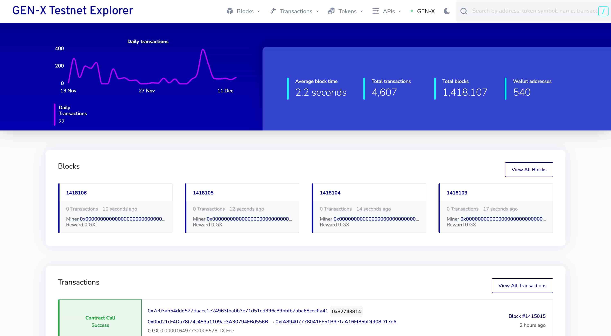

## Explore transactions

Located in the navbar you can find the transaction feed for the whole network. Every token transfer or cantract call will be listed there.

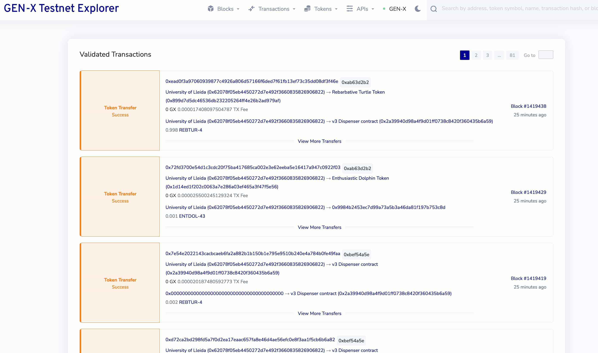

## Inspect Address details

Every address has its own details page. Known addresses will be resolved to clear names to enhance the human readability of network activity. You can see in the transactions which contracts have been called and which assets have been consumed. 

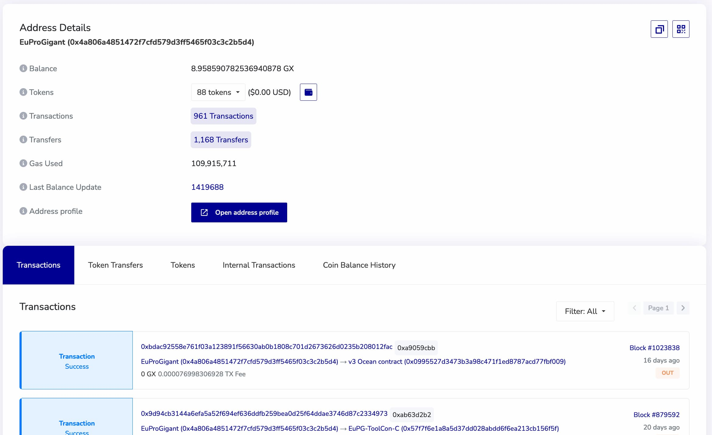

### View published assets in the address profile on Pontus-X

Click "Open address profile" to explore published and consumed assets on address profiles.

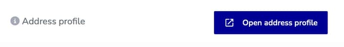

Browse the list of published assets in the address profile on the Pontus-X portal.

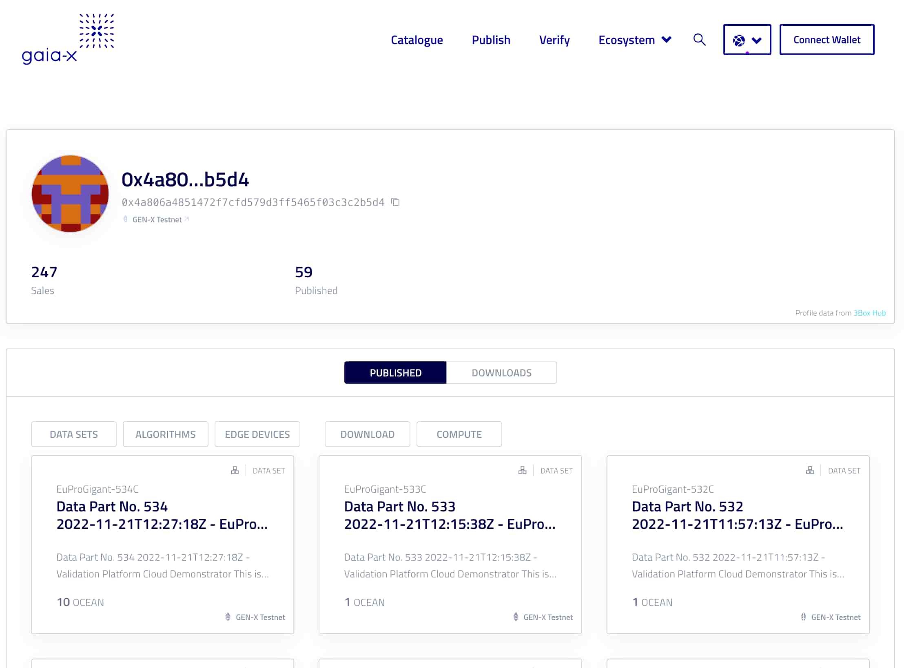

## Browse published assets represented as tokens

Assets are represented via token contracts. Tokens can be found [here](https://explorer.genx.minimal-gaia-x.eu/tokens). 

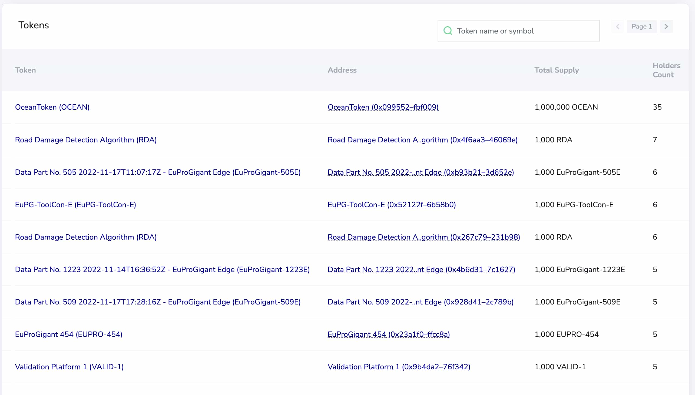

### One click to view asset listings on Pontus-X where you can explore a detailed description of the asset. 

Token pages link to the corresponding asset description on the Pontus-X portal, just click "Open asset page".

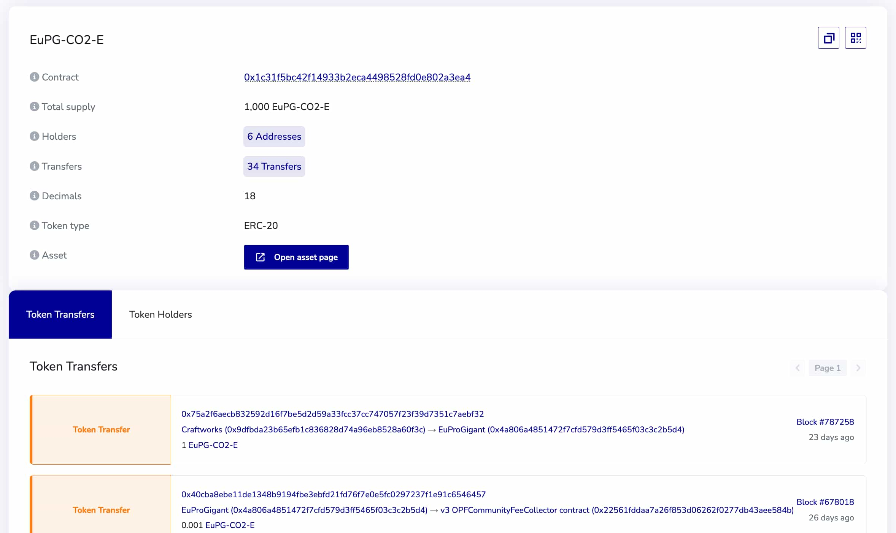

**Example algorithm asset:**
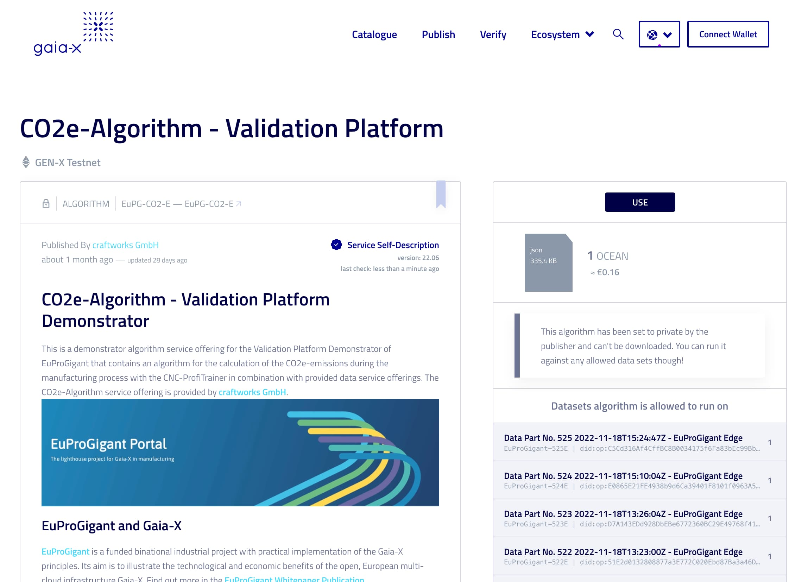

## Export service consumption and offering data as csv file

Find consumed services in the transactions and token transfer logs. You can download the logs as csv right from the explorer. You can find the export function at the bottom of the transaction or token transfer lists on address detail pages. 

The address name resolution is also integrated into the csv export function to improve human readablility. Also was the raw transcation input data added to enable deriving further insights on smart contract calls.

### Click Download CSV

The download button is bolow the **Transactions** or **Token Transfers** of every address detail page.

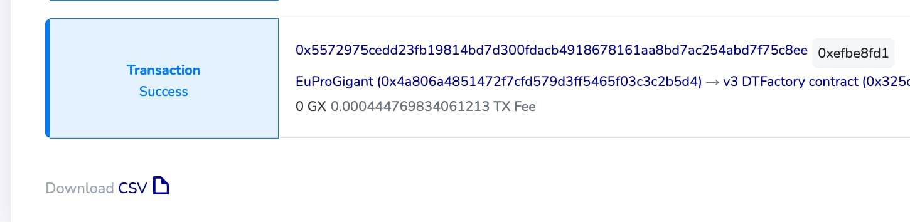

### Pick a timeframe

Pick a timeframe for your export. If your request fails, make sure to chose the timeframe to stay under the 30 seconds timeout limit.

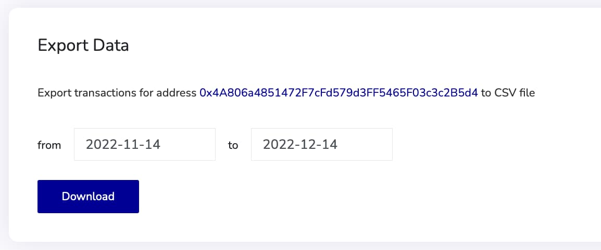

### Gain insights about service consumption and offerings

The data in csv format can now be utilized to gain further insights and generate reports.

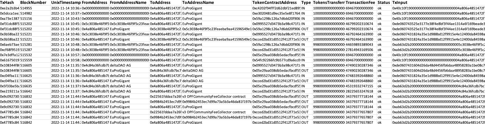

